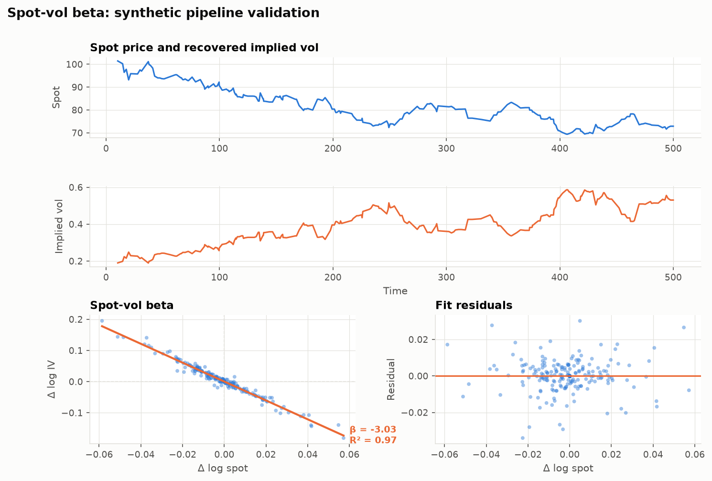
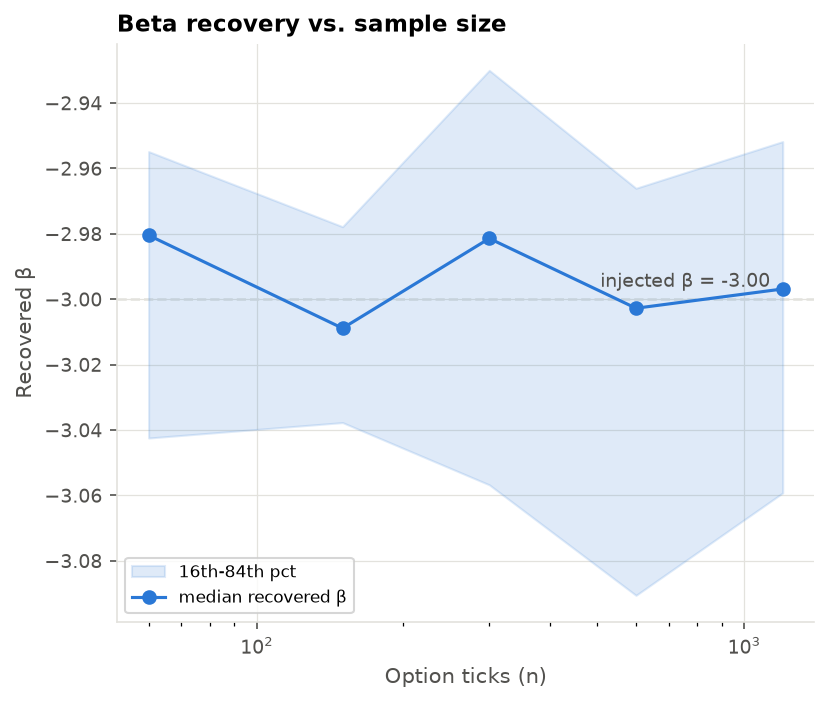

# spot-vol-hft

A tick-level options research project studying the relationship between spot
price moves and implied volatility, with the market-data-facing path in C++.

## What it does

Given a stream of underlying (spot) ticks and option ticks, the pipeline
aligns each option quote to its most recent spot price, inverts the option's
mid-price to implied volatility via Black-Scholes, and regresses changes in
log(IV) against changes in log(spot) to estimate a spot-vol beta:
`Δlog(IV) = β · Δlog(spot) + noise`. A synthetic data generator with a known,
injected beta is used to validate that the pipeline recovers it end-to-end.
The Black-Scholes pricer and tick synchronizer also have C++ implementations,
since tick processing eventually needs to run there instead of Python.

## Quick Start

### C++

```bash
cmake -S . -B build
cmake --build build -j
ctest --test-dir build
```

### Python (research pipeline)

```bash
cd research
pip install -e .
pytest
```

## Configuration

There's no config file — the only tunable surface today is
`spotvol.synthetic.generate()`, which produces synthetic spot/option ticks
with a known beta for pipeline validation:

| param                | meaning                              | default |
|----------------------|---------------------------------------|---------|
| `beta`               | injected spot-vol beta to recover     | `-3.0`  |
| `n_spot`, `n_option` | tick counts                           | `500`, `300` |
| `spot_vol`           | per-tick spot log-return stdev        | `0.01`  |
| `iv_noise`           | noise added to the IV process         | `0.005` |
| `spread`             | bid/ask spread on synthetic quotes    | `0.05`  |

## Usage

```python
from spotvol.synthetic import generate
from spotvol.align import align_ticks
from spotvol.features import build_features
from spotvol.beta import estimate_beta
from spotvol.plot import make_report_figure

spot_df, option_df = generate(beta=-3.0, seed=42)
aligned = align_ticks(spot_df, option_df)
features = build_features(aligned)
result = estimate_beta(features)     # BetaResult(beta, intercept, r_squared, se_beta)

make_report_figure(features, result)
```

This is exactly the path exercised by `research/tests/test_pipeline.py`.
`spotvol.plot` also exposes the individual panels
(`plot_price_and_iv`, `plot_spot_vol_beta`, `plot_residuals`) and
`plot_beta_recovery` for the sample-size study below.

## Figures

`python research/scripts/generate_figures.py` regenerates these from the
synthetic pipeline.

**Pipeline validation** — the raw spot/IV process, the fitted spot-vol
relationship, and the fit residuals:



**Beta recovery vs. sample size** — median recovered β (16th–84th
percentile band across 30 seeds per point) against the injected β = -3.0,
as the number of option ticks grows:



## Roadmap

What's built today is one strike, one horizon: a single beta estimated from
synthetic ticks. The direction from here:

- **Beta surface** — estimate beta per strike/expiry instead of one global
  number, across multiple horizons (100ms–5min).
- **Lead/lag analysis** — cross-correlate spot moves against IV moves at
  various lags to see whether the underlying or the option quote moves first.
- **Real tick data** — replace the synthetic generator with recorded
  spot + options quotes.
- **C++ event engine** — move tick ingestion, state maintenance, and the IV
  solver fully into C++ for the market-data-facing path (an order book /
  feed handler doesn't exist yet).
- **Delta-hedging experiment** — compare a standard delta hedge against one
  adjusted for the expected spot-vol beta, on hedged-P&L variance and
  turnover.

None of the above is implemented yet — this section describes intent, not
shipped functionality.
